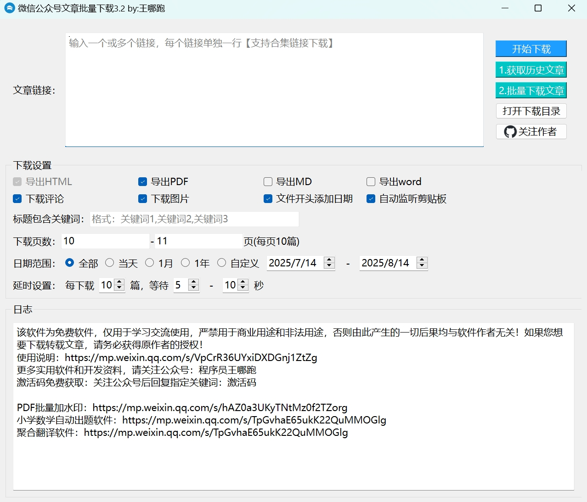

# 微信公众号文章批量下载工具
无需安装证书，**监听100%成功**，**链接监听秒级抓取**，支持Win10及以上版本

目前工具已支持：**单个文章下载、首页合集下载、标签合集下载、历史文章批量下载**

支持多格式导出：**word、pdf、html、markdown**

支持**评论导出**

# 软件下载链接
TG聊天群：https://t.me/changfengbox

百度网盘：https://ylb.ymf6.com/9H5v

夸克网盘：https://ylb.ymf6.com/CQdq

UC网盘：https://ylb.ymf6.com/crNj

欢迎关注公众号：程序员王哪跑，获取最新更新消息🥳

# 使用教程
3.2版教程链接：https://mp.weixin.qq.com/s/H-LbAG4F6NHKk8GtRUJORQ

3.0版教程链接：https://mp.weixin.qq.com/s/VpCrR36UYxiDXDGnj1ZtZg

2.0版教程链接：https://mp.weixin.qq.com/s/yNbTiYs2K-LcAuhqJaEn2w

# 免责声明
本软件仅供个人学习和研究使用，禁止用于其他任何用途，请在下载24小时内删除。用户在使用本软件时，应遵守当地法律法规，不得侵犯他人合法权益。

本软件的开发者不对任何因使用本软件而给他人造成的任何直接或间接损失承担责任，如因用户使用本软件而构成的任何侵权，均由用户自行承担。

本软件的版权归属本软件的开发者，开发者保留对本软件的任何调整、删除权利，用户在使用本软件时需自行承担风险。如遇到问题，请谨慎判断并自行处理。

请勿将本软件用于任何商业目的，请尊重知识产权，如果你想要转载这些文章，请务必获得原作者的授权！

# 更新日志
3.2更新：1、增加错误自动重试功能 2、下载出错后，会继续下载，不会自动停止程序

3.1更新：1、增加暂停下载、继续下载、停止下载的按钮 2、每获取完1页数据，就开始自动下载文章

3.0更新：1、支持评论下载 2、支持图片下载 3、支持word文件生成 4、支持筛选指定关键词的文章 5、优化并精简html文件的大小 6、修复反馈的问题

2.0更新：1、支持下载页数控制；2、支持日期范围筛选；3、可自由设置下载的延时时间；4、修复大家反馈的bug

1.2更新：支持一键下载公众号所有的历史文章，无需安装证书，且获取秘钥的速度极快；修复下载标签合集时因返回结果的差异而导致的报错问题。

1.0更新：支持单个文章下载、首页合集下载、标签合集下载

